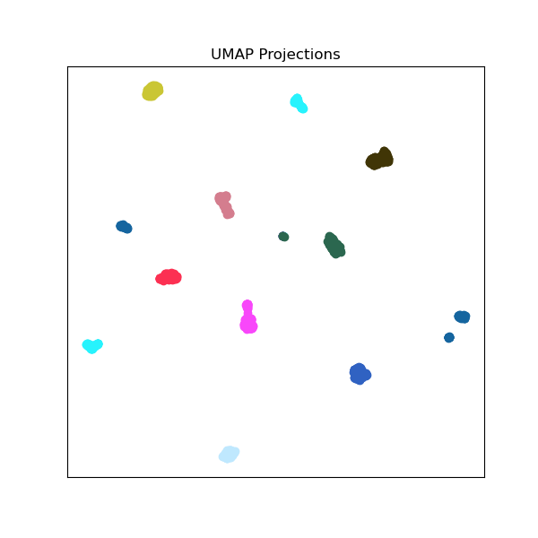
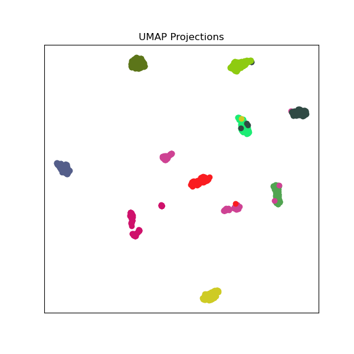

# Speaker Embedding 

This is a speaker embedding repository. This repo is used to collect various speaker embedders for various tasks like
1) Speaker Verification and Identification
2) Speaker Diarization
3) Speaker Extraction
4) Antispoofing for Speaker Verification
5) Text-to-Speech
6) Voice Conversion

## Installation

Use the package manager [conda](https://docs.conda.io/en/latest/) to setup the environment for running this repo.
First step, check the conda version:
```bash
conda -v
```
As of 05-04-2022, the scripts are tested in conda 4.12.0

The conda environment can be made using the following steps. For windows use the "speaker_embedding_windows.yml". Similarly, for linux use the file "speaker_embeddings.yml". Then initiate the conda environment

```bash
conda env create --file [name of the file].yml
conda activate speaker_embeddings
```
## Usage

The following bash script can be run to run the pipeline on "test_audio/librispeech_test-other"

```bash
bash run.sh
```

Or alternatively if you want to run manually, please refer to scripts/run_batch.py to learn more about the pipeline.

```bash
audio_dir=./test_audio/librispeech_test-other
ext=flac
yaml_file=./yaml/resemblyzer.yml

python scripts/run_batch.py ${audio_dir} ${ext} ${yaml_file}
```

## Pipeline
The following are the steps involved in the pipeline

1. The input data has to be of the following format. Prepare the pytorch data layout beforehand
```
  Audio-directories
		|--- Class 1
		|--- Class 2
		|--- Class 3
			|--- audio1.path
			|--- audio2.path
			|--- audio3.path
```

2. Build speaker-to-utterances dictionary (Output: spk2utt)
```
	Each dictionary has key-value:
	<speaker ID>: [<audio1.path>, <audio2.path>, ...]
```

3. Initate embedder from yaml file (Output: embedder)
```
   The yaml configuration will load everything dynamically
   and build the embedder accordingly
```

4.  Get embeddings using function get_embeddings (Output: spk2emb)
```	
    This function will apply the embedder onto the spk2utt
	Bascially, 2 for loops
		- Loop 1: Go through all speakers in spk2utt
		- Loop 2: For each speaker, loop through all audio files
		- Stack all embeddings belonging to speaker
	Returns a speaker-to-embeddings dictionary
```

5. These Embeddings can be plotted using either T-SNE or UMAP for visualization. The final images are stored in png directory.

## Results

The following is the UMAP projection for 10 speakers chosen from the LibriSpeech ASR corpus. The embedding chosen was Resemblyzer. 




The following is the UMAP projection for 10 speakers chosen from the LibriSpeech ASR corpus. The embedding chosen was Xvectors. 



## Authors
Zhi Hao Lim (School of Computer Science and Engineering, NTU)

Pranav V Grandhi (Computer Science, BITS Pilani, Hyderabad Campus)
